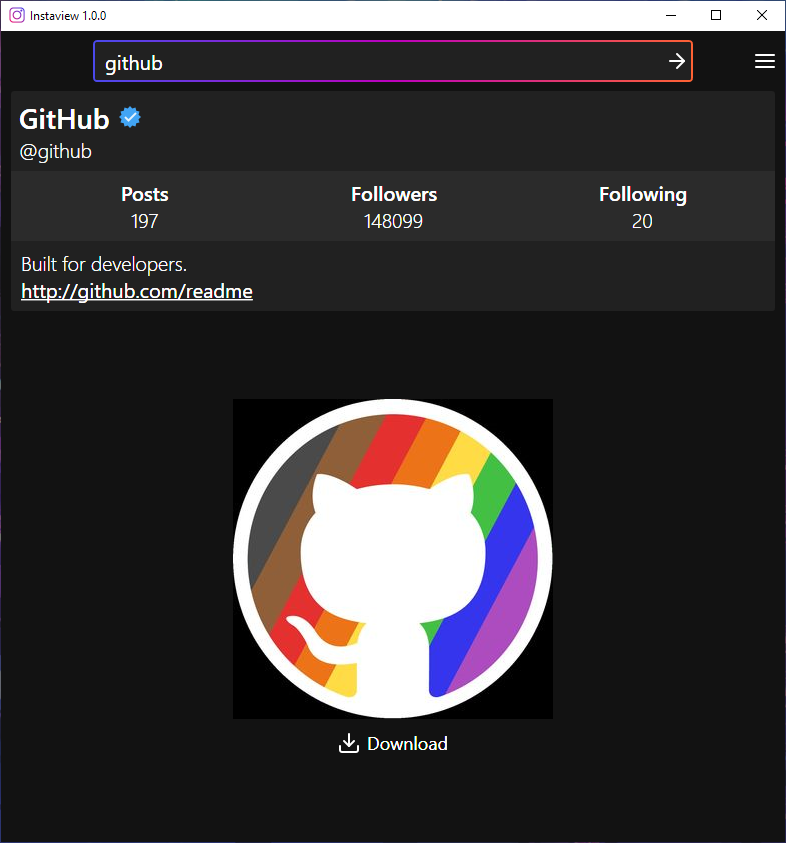

# A centralised hub for all your profile-viewing needs
Instaview provides a facility to search for Instagram user's by username or URL, and displays useful information about their profile, such as their follower, following, and post count.
Included with this is the user's account status - whether they are private, verified, or a business account.
The user's full name, bio, and any URLs linked to the account are also provided.

Of course, the main attraction however, is the ability to **_view_** and **_download_** a user's profile picture in its native resolution!

> Instaview uses my [Instasharp](https://www.github.com/codedbycurtis/Instasharp) API, which allows profiles to be viewed **without** needing to log in!

## Main Features:
- View an Instagram user's profile **without** needing to log in!
- Download their profile picture in high-definition.
- Private accounts display a padlock, while verified accounts display a tick.
- Business accounts will have their specified category listed.
- Get their full name, bio, and website - if they have provided them.
- See how many people they follow, are followed by, and how many posts they have.

### Showcase

## System Requirements
- The **.NET 5.0 Runtime**, which can be downloaded [here](https://dotnet.microsoft.com/download/dotnet/5.0/runtime).
